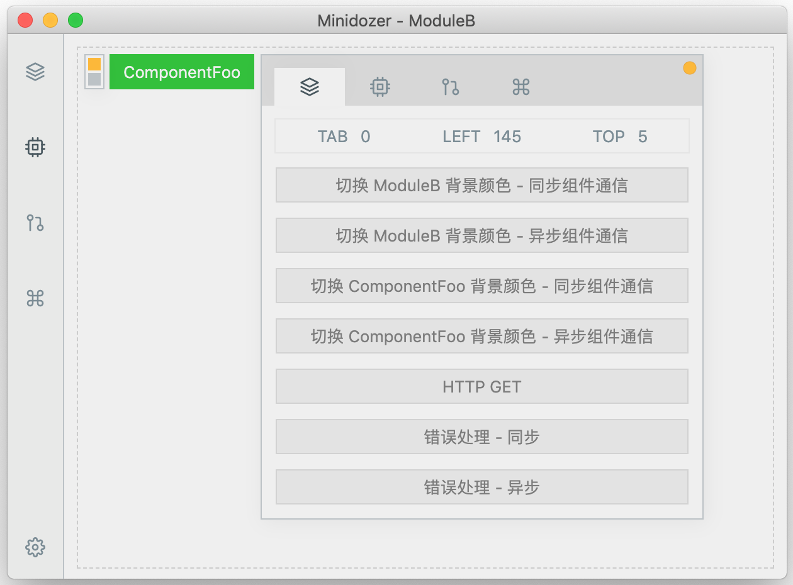
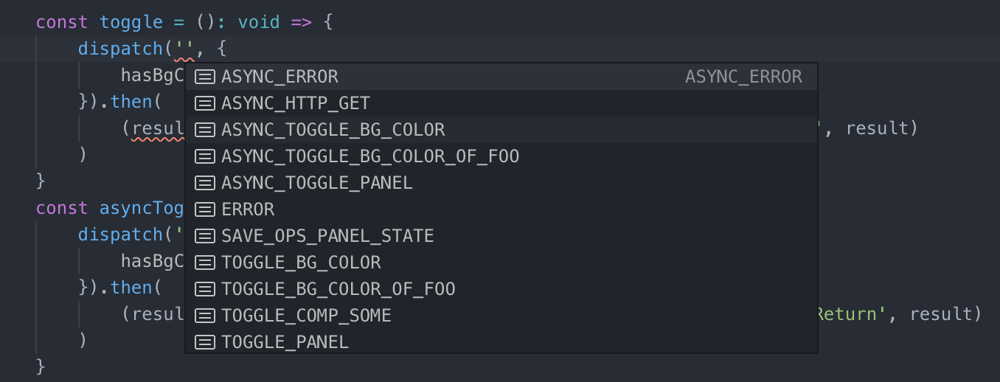
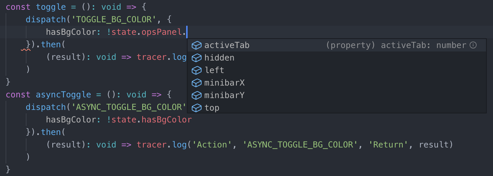

# Minidozer

Minidozer 是一个轻量级 Electron + React + TypeScript 工程模板

- 函数组件 + Styled-components + CSS Grid 组合，简单易维护
- 内置微框架，基于 React Hook & TypeScript 支持状态管理、模块化、代码提示
- 内置异步 Action 处理、状态跟踪，并提供接口支持编写自定义插件
- 最小化依赖组合，版本更新及时，配置满足基础需求，使用改造成本低

核心依赖版本：

- Electron v6.0.7
- React v16.9.0
- TypeScript v3.6.2
- Webpack v4.32.2

## 为什么

很难找到满意的模版，总而言之，要么不能覆盖需求，要么既复杂又不能覆盖需求......

## 截图





## 模版内容

- 项目文件组织结构
- 示例应用 - "Minidozer"
- Electron
  - 初始代码 & 应用打包配置
- React
  - HMR
    - 【优化】采用 @hot-loader/react-dom 方案，避免引入 Babel 依赖
  - 模块化
    - 内置 Hook API 实现
    - 内置模块路由
  - 状态管理
    - 基于 Hook API 实现，无 Redux 依赖
    - 模块化，不依赖单一状态树
    - 支持同步 & 异步 Action
    - 暂态处理 - 内置 Action 操作状态信息队列，供UI读取展现
    - 可跟踪输出状态变化信息，便于调试
  - 通信机制
    - 组件间通信（基于状态管理，支持同步 & 异步）
    - 模块间通信（基于状态管理，支持同步 & 异步）
  - 组件（仅包含示例应用涉及组件）
  - 代码规范
    - 使用函数组件
    - 使用 Styled-components 作为 CSS-in-JS 样式控制方案
    - 使用 CSS Grid 布局
  - 测试
    - ~~单元测试~~
    - ~~快照测试~~
    - ~~E2E 测试~~
- TypeScript
  - 使用 ESLint 进行代码检查
- Webpack
  - v4.32.2
  - 最小化配置，使用默认优化项
  - 【优化】关闭 "ts-loader" 类型检查，配合使用 ForkTsCheckerWebpackPlugin 进行异步检查
  - 【优化】使用 DllPlugin 提取公共代码
  - 【优化】提取 runtimeChunk

## Hook API

compose - 定义模块组件

```javascript
// modules/foo/index.tsx

import { compose, ModuleContext } from '@minidozer/Module' // 内置模块化工具
import { actions, ActionType } from './actions' // 模块 Actions 及 Action-Type 类型
import { reducer, State, defaultState } from './reducer' // 模块 Reducer、默认 state、 state 类型

export type Context = ModuleContext<State, ActionType> // 导出模块 Context 类型

export default compose<Props, State, Types>('ModuleFoo', actions, reducer, defaultState, (props): ReactElement => {
    const { state, dispatcher, suspense, tracer } = props

    // 作用于模块 ModuleFoo，代码提示可用
    dispatcher.dispatch('ACTION_TYPE', payload)

    // suspense 包含当前模块所有 Action 的实时状态队列
    return(
      <Fragment>
        <SubComponent {...state} />
        <ActionStatusIndicator queue={suspense}/>
      </Fragment>
    )
  }
)
```

useModuleContext - 引用模块上下文资源

```javascript
// modules/foo/some-component/index.tsx 或 modules/bar/some-component/index.tsx

import { useModuleContext } from '@minidozer/Module'
import { Context } from '@modules/foo'

export function SomeComponent(): ReactElement {
    const { state, dispatcher, suspense, tracer } = useModuleContext<Context>('ModuleFoo')

    // 作用于模块 ModuleFoo，代码提示可用
    dispatcher.dispatch('ACTION_TYPE', payload)

    return(<Fragment />)
}
```

useRouter - 模块路由

```javascript
// modules/../layout.tsx

export function Layout(): ReactElement {
    // "active" 为模块组件 "ModuleNav" 内部状态，对应当前处于可见状态的模块名（ "ModuleA"|"ModuleB"|"ModuleC" ）
    const [router, route] = useRouter('active')

    return(
        <Fragment>
            <ModuleNav router={router} />
            <ModuleA route={route}/>
            <ModuleB route={route}/>
            <ModuleC route={route}/>
        </Fragment>
    )
}
```

## 编写自定义插件

```javascript
// 以内置插件 “logMiddleware” 为例

import { middlewares, Middleware } from '@minidozer/Middleware'
import { log } from '@minidozer/Utils'

const logMiddleware: Middleware = async params => {
    const { moduleName, state, action, reducer } = params

    log('Minidozer.Dispatcher')('Action', {
        'From': moduleName,
        'Prev State': state,
        'Action': action.next,
        'Next State': reducer(state, action.next)
    })
}

middlewares.external = [userDefinedMiddlewareA]
```

## 使用

``` makefile
# 安装依赖
$ npm install

# 编译动态链接库
$ npm run build:dll

# 启动开发服务
$ npm run dev

# 资源分析
$ npm run analyze:dll
$ npm run analyze:bundle

# 测试
# $ npm run test:unit
# $ npm run test:e2e

# 应用打包
$ npm run build:mac
```
