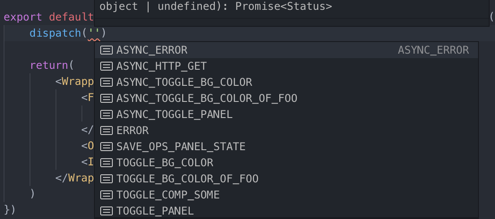

# Minidozer

Minidozer 是一个轻量级 Electron + React + TypeScript 工程模板

## 为什么

很难找到满意的模版，总而言之，要么不能覆盖需求，要么既复杂又不能覆盖需求......

## 截图




## 模版内容

- 项目文件组织结构
- 示例应用 - "Minidozer"
- Electron
  - v6.0.0-beta.5
  - 初始代码 & 应用打包配置
- React
  - v16.8.6
  - HMR
    - 【优化】采用 @hot-loader/react-dom 方案，避免引入 Babel 依赖
  - 模块化
    - 内置 Hook API 实现
    - 内置模块路由
    - 内置 Action 操作状态信息队列
  - 状态管理
    - 部分依赖 Redux 实现
    - 分散化 State（基于模块化）
    - 同步 & 异步 Action
  - 通信机制
    - 组件间通信（基于状态管理，支持同步 & 异步）
    - 模块间通信（基于状态管理，支持同步 & 异步）
  - 组件（仅包含示例应用涉及组件）
  - 代码规范
    - 使用函数组件
    - 使用 Styled-components 作为 CSS-in-JS 样式控制方案
    - 使用 CSS Grid 布局
  - 测试
    - ~~单元测试~~
    - ~~快照测试~~
    - ~~E2E 测试~~
- TypeScript
  - v3.4.5
- Webpack
  - v4.32.2
  - 最小化配置，使用默认优化项
  - 【优化】关闭 "ts-loader" 类型检查，配合使用 ForkTsCheckerWebpackPlugin 进行异步检查
  - 【优化】使用 DllPlugin 提取公共代码
  - 【优化】提取 runtimeChunk
- 最小化依赖组合
- 使用 ESLint 进行代码检查

## Hook API

```javascript
// useRouter - 切换模块组件

function Layout(): ReactElement {
    // "active"参数为ModuleNavbar组件内部状态，其值对应当前处于可见状态的模块名称（ ModuleA|ModuleB|ModuleC ）
    const [router, route] = useRouter('active')

    return(
        <Fragment>
            <ModuleNav router={router} />
            <ModuleA route={route}/>
            <ModuleB route={route}/>
            <ModuleC route={route}/>
        </Fragment>
    )
}
```

```javascript
// compose - 定义模块组件

function compose<Props, State, Types>('ModuleFoo', actions, reducer, ({ state, dispatcher, suspense, tracer }): ReactElement => {
    // 作用于模块ModuleFoo内部
    dispatcher.dispatch('ACTION_TYPE', payload)

    // suspense包含当前模块所有Action的实时状态队列
    return(
      <Fragment>
        <SubComponent {...state} />
        <ActionStatusIndicator queue={suspense}/>
      </Fragment>
    )
  }
)
```

```javascript
// useModuleContext - 引用模块操作

function SomeComponent(): ReactElement => {
    const { state, dispatcher, suspense, tracer } = useModuleContext('ModuleFoo')

    dispatcher.dispatch('ACTION_TYPE', payload)

    return(<Fragment />)
})
```

## 使用

``` makefile
# 安装依赖
$ npm install

# 编译动态链接库
$ npm run build:dll

# 启动开发服务
$ npm run dev

# 资源分析
$ npm run analyze:dll
$ npm run analyze:bundle

# 测试
# $ npm run test:unit
# $ npm run test:e2e

# 应用打包
$ npm run build:mac
```
